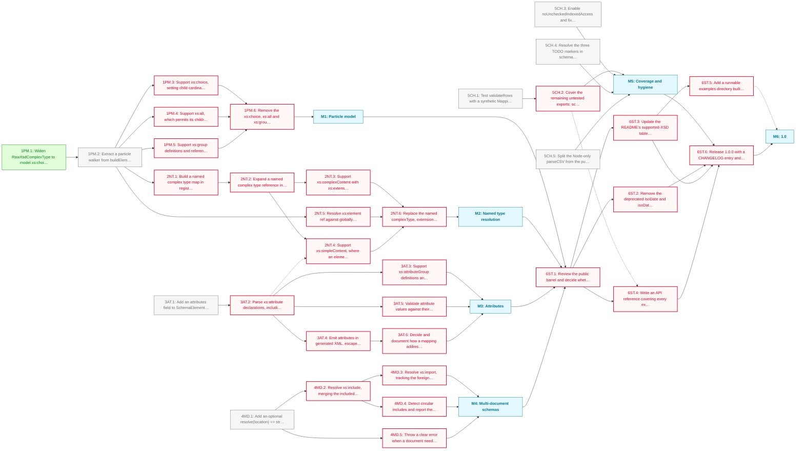

# schema-forge PHASE_1 Roadmap

Everything deferred while schema-forge was being extracted, packaged and corrected. The 0.2.0 release made unsupported XSD constructs fail loudly instead of silently dropping content; this phase makes them work, then commits to a stable API.

**Critical path:** `1PM.1 → 1PM.2 → 2NT.1 → 2NT.2 → 2NT.3 → 2NT.6 → 6ST.1 → 6ST.6` — the particle walker unblocks both compositor support and named type resolution, and named types are what most real-world XSD depends on.

---

## Milestone 1 — Particle model

**Goal:** Walk XSD content models generically so compositors other than `xs:sequence` carry their children.

- [x] **1PM.1** — Widen `RawXsdComplexType` to model `xs:choice`, `xs:all` and `xs:group` as real shapes rather than `unknown` placeholders
- [ ] **1PM.2** — Extract a particle walker from `buildElement` so content models are traversed generically
  - Note: `elementBuilder.ts:58` is the hardcoded read. This refactor is what makes M1 and M2 cheap; do it once and properly.
  - Note: `parseXsd` runs without `preserveOrder`, so siblings collapse into keys and the order of an `xs:element` followed by an `xs:choice` is unrecoverable. The walker can traverse each key but cannot reconstruct schema order across keys. Constrains 1PM.4, since the generator emits children in schema order.
  - Note: a particle under `xs:complexType` is always a single value, since XSD permits at most one there; a particle nested inside another is `T | T[]`. The types encode this distinction.
- [ ] **1PM.3** — Support `xs:choice`, setting child cardinality min to 0 _(blocked — depends on 1PM.2)_
- [ ] **1PM.4** — Support `xs:all`, which permits its children in any order _(blocked — depends on 1PM.2)_
  - Note: Interacts with the generator, which currently emits children in schema order.
- [ ] **1PM.5** — Support `xs:group` definitions and references _(blocked — depends on 1PM.2)_
- [ ] **1PM.6** — Replace the throwing guards with behavioural tests _(blocked — depends on 1PM.3, 1PM.4, 1PM.5)_

---

## Milestone 2 — Named type resolution

**Goal:** Resolve named complex types, inheritance and element references so idiomatic XSD builds correctly.

- [ ] **2NT.1** — Build a named complex type map from the existing but uncalled `extractNamedComplexTypes` _(blocked — depends on 1PM.2)_
  - Note: It is exported from the barrel but has no production call site. `resolveBaseType` only consults simple types.
- [ ] **2NT.2** — Expand a named complex type reference into its particle, with a visited-type set _(blocked — depends on 2NT.1)_
  - Note: The most idiomatic XSD construct the library rejects, so the highest-value task in the phase.
- [ ] **2NT.3** — Support `xs:complexContent` with `xs:extension` _(blocked — depends on 2NT.2)_
- [ ] **2NT.4** — Support `xs:simpleContent` _(blocked — depends on 2NT.2)_
- [ ] **2NT.5** — Resolve `xs:element ref` against globally declared elements _(blocked — depends on 1PM.2)_
  - Note: Also requires relaxing the multi-root guard, which currently throws before `buildElement` runs.
- [ ] **2NT.6** — Replace the throwing guards with behavioural tests _(blocked — depends on 2NT.3, 2NT.4, 2NT.5)_

---

## Milestone 3 — Attributes

**Goal:** Carry XSD attributes through the registry and into generated XML.

- [ ] **3AT.1** — Add an `attributes` field to `SchemaElement`
  - Note: Independent of the particle work. fast-xml-parser already surfaces attributes; `buildElement` discards them.
- [ ] **3AT.2** — Parse `xs:attribute` declarations, including `use="required"` _(blocked — depends on 3AT.1)_
- [ ] **3AT.3** — Support `xs:attributeGroup` _(blocked — depends on 3AT.2)_
- [ ] **3AT.4** — Emit attributes in generated XML, escaped _(blocked — depends on 3AT.2)_
- [ ] **3AT.5** — Validate attribute values and report missing required attributes _(blocked — depends on 3AT.2)_
- [ ] **3AT.6** — Support attribute paths in `mapCsvToSchema` _(blocked — depends on 3AT.4)_
  - Note: Open design question: an `@` prefix (`Root.Child.@id`) reads unambiguously against element paths.

---

## Milestone 4 — Multi-document schemas

**Goal:** Resolve `xs:include` and `xs:import` so schemas split across files can be loaded.

- [ ] **4MD.1** — Add an optional `resolve(location) => string` callback to `SchemaRegistryOptions`
  - Note: An injected synchronous resolver keeps `buildSchemaRegistry` synchronous so no existing call site breaks, keeps the package runtime-agnostic, and leaves room for an async variant later. Sync-to-async is additive; async-to-sync is impossible.
- [ ] **4MD.2** — Resolve `xs:include` _(blocked — depends on 4MD.1)_
- [ ] **4MD.3** — Resolve `xs:import`, tracking the foreign namespace _(blocked — depends on 4MD.2)_
  - Note: Harder than include: imported types belong to a different namespace, so the registry must disambiguate.
- [ ] **4MD.4** — Detect circular includes _(blocked — depends on 4MD.2)_
- [ ] **4MD.5** — Throw when resolution is needed but no resolver was supplied _(blocked — depends on 4MD.1)_

---

## Milestone 5 — Coverage and hygiene

**Goal:** Test everything the package exports and modernise the conventions the code still carries.

- [ ] **5CH.1** — Test `validateRows` with a synthetic `MappingConfig`
  - Note: The only exported function with no test coverage at all.
- [ ] **5CH.2** — Cover the remaining untested exports _(blocked — depends on 5CH.1)_
- [ ] **5CH.3** — Enable `noUncheckedIndexedAccess` and fix the resulting errors
  - Note: Deferred at 0.1.0 as too large. Measured since: 40 errors, mostly indexed access, each a real spot where an out-of-bounds index yields `undefined`.
- [ ] **5CH.4** — Resolve the three stale TODO markers in `schemaTypes.ts`
- [ ] **5CH.5** — Split the Node-only `parseCSV` from the pure `parseCSVContent`
  - Note: `csvParser.ts:14` is the only Node coupling in the library.

---

## Milestone 6 — 1.0

**Goal:** Commit to a stable public API and release 1.0.0.

- [ ] **6ST.1** — Review the public barrel and decide whether the schema construction helpers belong in the supported API _(blocked — depends on M1, M2, M3, M4)_
- [ ] **6ST.2** — Remove the deprecated `isoDate` and `isoDateTime` aliases _(blocked — depends on 6ST.1)_
- [ ] **6ST.3** — Update the README's supported-XSD table and limitations _(blocked — depends on 6ST.1)_
- [ ] **6ST.4** — Write an API reference _(blocked — depends on 6ST.1)_
- [ ] **6ST.5** — Add a runnable examples directory _(blocked — depends on 6ST.3)_
- [ ] **6ST.6** — Release 1.0.0 _(blocked — depends on M5, 6ST.2, 6ST.3, 6ST.4)_

---

## Dependency Diagram

